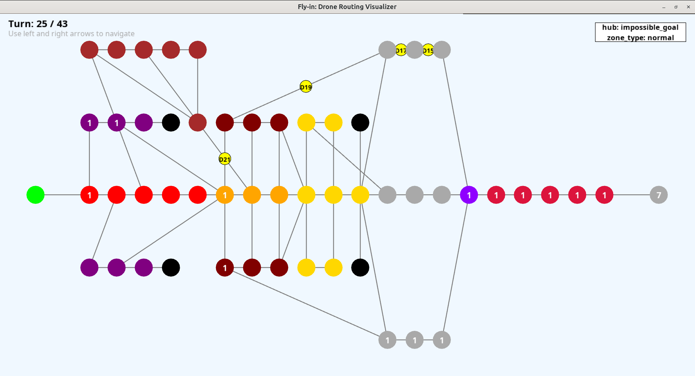

*This project has been created as part of the 42 curriculum by advacher.*

## Description

**Fly-in** is an autonomous drone routing simulation. The main objective of this project is to design a system that efficiently navigates a fleet of drones from a central starting base to a target end location. The network is represented as a dynamic graph of connected zones. The challenge is to find the most efficient paths to minimize the total number of simulation turns while strictly respecting movement rules and zone capacity constraints.
## Instructions
The project is built with Python 3.10+. We use `uv` for fast dependency management and `arcade` for the graphical interface. 

A `Makefile` is provided to automate common tasks.

**Installation**
To install the project dependencies, run:
```bash
make install
```
**Execution**
To run the program 
```bash
  make run
```
To run the simulation with a specific map, use:
```bash
  make run MAP=maps/easy/01_linear_path.txt
```

**Other Commands**
```
make debug: Runs the main script in debug mode.

make clean: Removes temporary files and cache like __pycache__ to keep the environment clean.

make lint: Checks the code quality using flake8 and mypy to ensure strict typing.
```

## Resources

* **Pathfinding Algorithms:** [Glassus - algorithme de Dijkstra](https://www.youtube.com/watch?v=rI-Rc7eF4iw)

* **Arcade Library Documentation**: Used for rendering the 2D simulation window. [Arcade-academy](https://api.arcade.academy/en/stable/)

* **AI Usage**:
Artificial Intelligence was used to help develop this project in the following ways:

  * **Project Structure and Testing**: AI helped to organize the code and write unit tests.

  * **Finding Bugs**: Before the graphical visualizer was finished, AI helped to find bugs and check if the algorithm calculated the correct paths.

  * **User Interface**: AI helped to build specific UI features for the Arcade visualizer, like showing tooltips when you move the mouse over a node.

  * **Documentation**: Finally, AI was used to check the grammar and improve the English in this README.


## Algorithm Choices and Implementation Strategy

To solve the routing problem efficiently, the project uses a time-aware pathfinding approach:

* **Graph Representation**: Data is parsed and converted into a Graph object composed of Node elements. Each node holds data about its type (normal, restricted, priority) and capacity.

* **Path Existence Verification (BFS)**: Before running the heavy pathfinding logic, a preliminary Breadth-First Search (BFS) is executed via the is_one_solution method. It acts as an optimization guard, checking whether at least one unblocked spatial path exists from the start hub to the end hub.

* **Time-Space Dijkstra**: The PathFinder class uses a Dijkstra algorithm based on a priority queue (heapq). Instead of just exploring spatial nodes, it explores TimeNode states (Node + Turn).

* **Reservation Table**: To prevent drone collisions and respect zone capacities (e.g., max_drones, max_link_capacity), a ReservationTable tracks how many drones occupy a specific node or connection at a specific turn. If a node is full, the algorithm evaluates the cost of waiting (_wait method) versus taking an alternative route.

## Visual Representation

To enhance the user experience and make debugging easier, a graphical interface is implemented using the Python arcade library.

* **Interactive Layout**: The GraphLayout calculates normalized screen coordinates to fit any map on the screen.

* **Visual States**: Zones are drawn as circles, and connections as lines. The colors of the nodes change based on their specific type or provided metadata.

* **Simulation Tracking**: Drones are represented dynamically. You can use the LEFT and RIGHT arrow keys to navigate forward and backward through the simulation turns step-by-step.

* **Tooltips**: Hovering over a node with the mouse reveals its name, making it easy to track specific network hubs.

## Input / Output
Several sample maps are already provided in the maps directory to help you launch the project. 

Here is an example of a simple linear path (Easy Level 1):
```
# Easy Level 1: Simple linear path
nb_drones: 2

start_hub: start 0 0 [color=green]
hub: waypoint1 1 0 [color=blue]
hub: waypoint2 2 0 [color=blue]
end_hub: goal 3 0 [color=red]

connection: start-waypoint1
connection: waypoint1-waypoint2
connection: waypoint2-goal
```
*Expected Output* :

When executing the project with the map above, a standard output will look like this:
```
D1-waypoint1
D1-waypoint2 D2-waypoint1
D1-goal D2-waypoint2
D2-goal

The average number of turns per drone 3.5

Number of drones moved at the turn 1 is 1
Number of drones moved at the turn 2 is 2
Number of drones moved at the turn 3 is 2
Number of drones moved at the turn 4 is 1
```
## Project Architecture
Below is a visual representation of how the different components of **Fly-in** interact:
```mermaid
graph TD
    %% Define Styles
    classDef parser fill:#e1f5fe,stroke:#03a9f4,stroke-width:2px,color:black;
    classDef algo fill:#f1f8e9,stroke:#8bc34a,stroke-width:2px,color:black;
    classDef gui fill:#fff3e0,stroke:#ff9800,stroke-width:2px,color:black;
    classDef resource fill:#ffebee,stroke:#f44336,stroke-width:2px,color:black;

    %% Parsing Process
    subgraph Parsing_Process ["1. Parsing & Validation"]
        P1["Read .map file"] --> P2["MapParser"]
        P2 --> P3{"Pydantic Models<br/>(Zone & Connection)"}
        P3 -->|Invalid| P_Err["Raise ValueError"]
        P3 -->|Valid| P4["Instantiate DataMap"]
    end

    %% Pathfinding Engine
    subgraph Pathfinding_Engine ["2. Pathfinding Engine (Dijkstra)"]
        A1["Graph Init"] --> A2["Populate TimeNode Queue"]
        A2 --> A3{"Check Neighbors<br/>(ReservationTable)"}
        
        %% Logique de déplacement et de coût
        A3 -->|Capacity Full| A4["_wait : Cost + 1"]
        A3 -->|Capacity Free| A5["_maj_tab : Move Node"]
        
        %% File de priorité
        A4 -.->|Push to heapq| A6["Priority Queue<br/>(not_visited)"]
        A5 -.->|Push to heapq| A6
        A6 --> A7{"End Zone Reached?"}
        
        A7 -->|No| A3
        A7 -->|Yes| A8["_reconstruct_path"]
    end

    %% GUI & Simulation
    subgraph GUI_Process ["3. Arcade Visualizer & Simulation"]
        G1["GraphLayout"] --> G2["Calculate Screen Coords"]
        G2 --> G3["SimulationState Loop"]
        G3 --> G4{"Key Press<br/>(Left/Right)"}
        
        G4 -->|next_turn| G5["Update Drone Positions"]
        G4 -->|previous_turn| G5
        
        G5 --> G6["FlyInVisualizer: on_draw"]
        G6 --> G3
    end

    %% Shared Resources / Core Data
    subgraph Shared_Resources ["Core Data & State"]
        DataMap_Res[("DataMap<br/>(Parsed Config)")]
        Graph_Res[("Graph<br/>(Node Network)")]
        Table_Res[("ReservationTable<br/>(Time-Space Array)")]
    end

    %% Cross-Subgraph Interactions
        P4 -.->|Feeds| DataMap_Res
    DataMap_Res -.->|Builds| Graph_Res
    
    Graph_Res -.->|Topology| A1
    Graph_Res -.->|Spatial Data| G1
    
    A3 -.->|Check & Reserve| Table_Res
    A8 -.->|drone_paths| G3

    %% Apply Styles
    class P1,P2,P3,P4,P_Err parser;
    class A1,A2,A3,A4,A5,A6,A7,A8 algo;
    class G1,G2,G3,G4,G5,G6 gui;
    class DataMap_Res,Graph_Res,Table_Res resource;